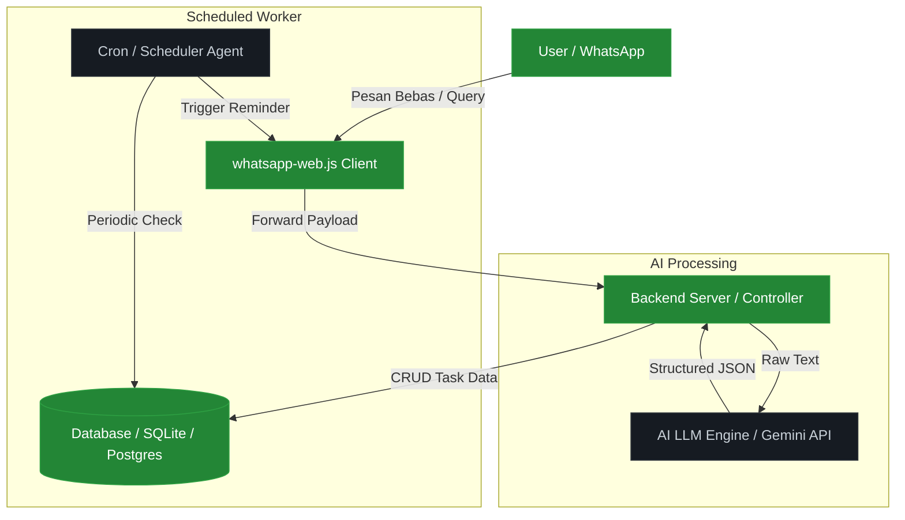

# AI-Whatsapp-Task-Manager
## Artificial intelligent LLM integration to whatsapp chat using whatsapp-web.js to manage daily task, project and activity. AI will send reminder by whatsapp notification to registered user.

## Architechture
# Task Manager & Reminder (AI + WhatsApp Web)

Sistem pengelola tugas dan pengingat otomatis berbasis AI yang terintegrasi dengan WhatsApp.

---

## 1. Grafik Arsitektur & Alur Kerja



---

## 2. Penjelasan Arsitektur Sistem

### A. WhatsApp Web Integration (`whatsapp-web.js`)
* **Inbound Listener:** Menerima pesan teks dari pengguna terdaftar secara *real-time*.
* **Outbound Sender:** Mengirimkan balasan jawaban atau notifikasi pengingat otomatis.

### B. AI LLM Engine (Parser & Brain)
* **Text Parsing:** Memproses teks input bebas (misal: *"tugas matematika diberikan tanggal 8, deadline tanggal 11"*) menjadi struktur data JSON berformat:
  ```json
  {
    "task_name": "Matematika",
    "assigned_date": "2026-10-08",
    "deadline": "2026-10-11",
    "priority": "HIGH"
  }
  ```
* **Query Processing:** Menyusun urutan prioritas tugas dan menjawab pertanyaan pengguna mengenai daftar tugas aktif.

### C. Database Storage
* Menyimpan entitas data *User*, *Tasks*, dan *Log Notifikasi* untuk memastikan jadwal pengingat tidak dikirim berulang kali.

### D. Cron / Scheduler Agent
* Berjalan secara latar belakang (*background job*) untuk mengecek deadline mendekati **H-1**.
* Memicu modul `whatsapp-web.js` untuk mengirimkan pesan pengingat otomatis ke nomor pengguna terkait.
